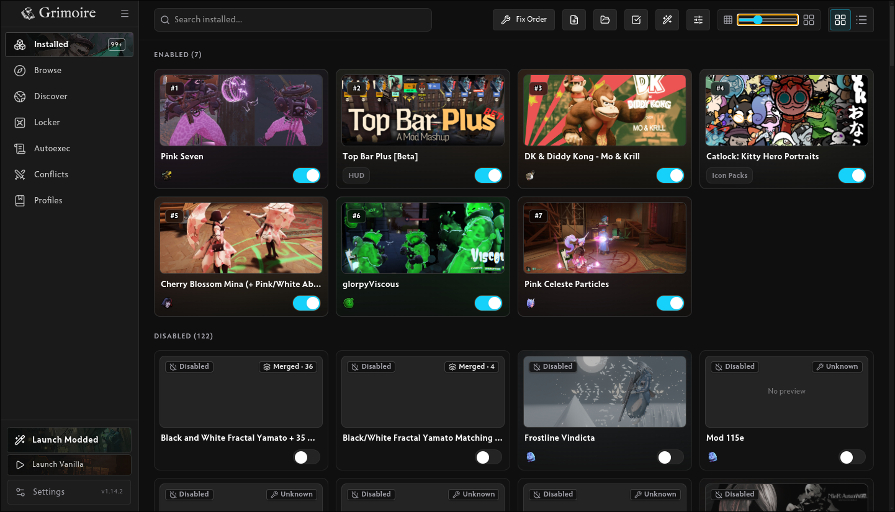
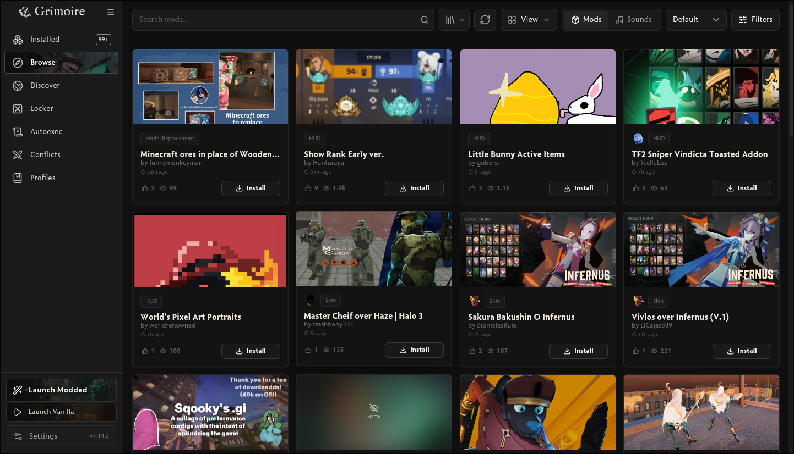
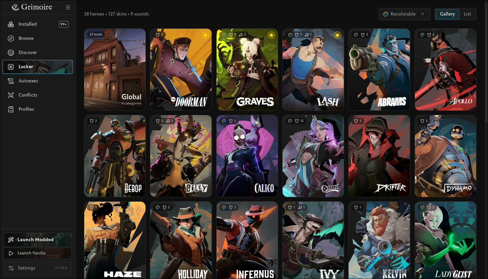
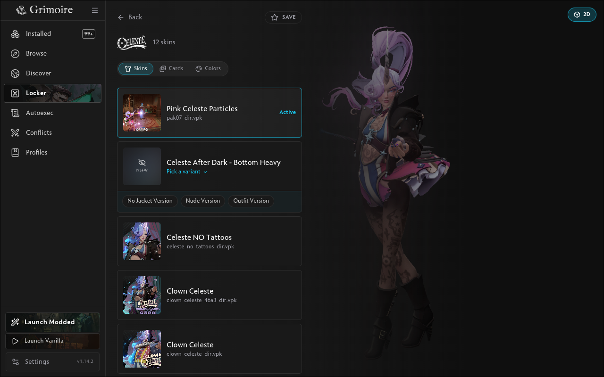
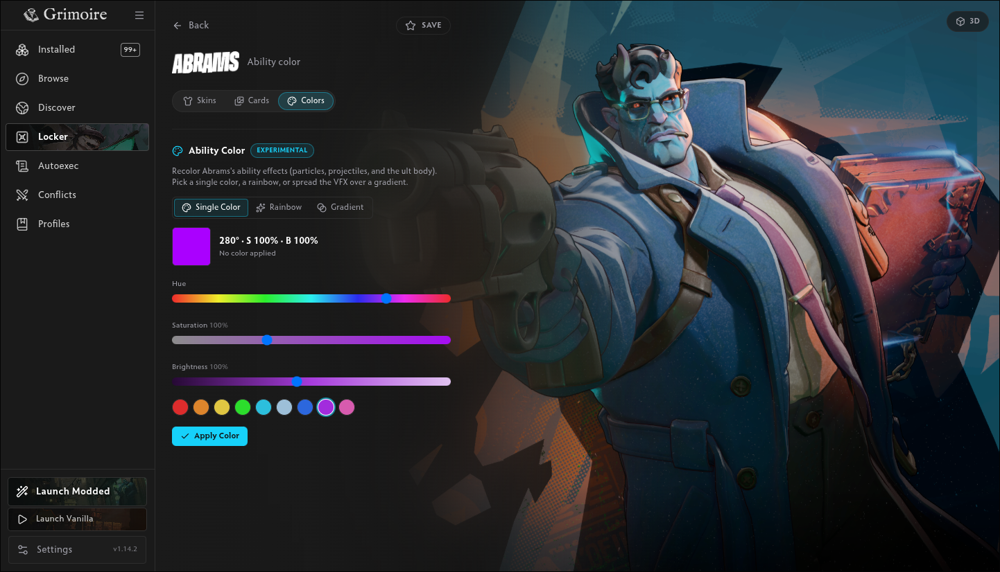
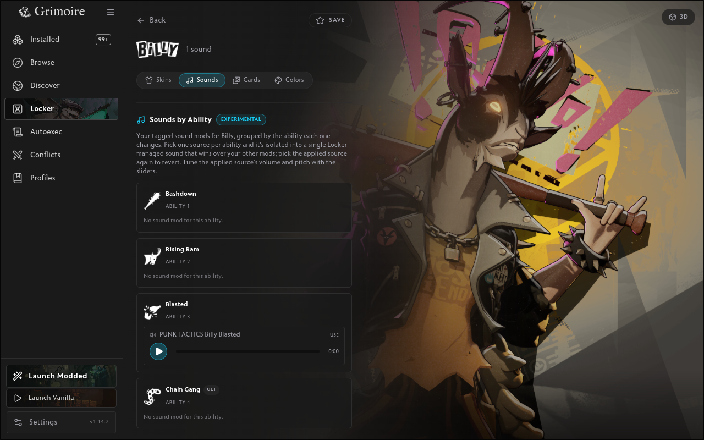
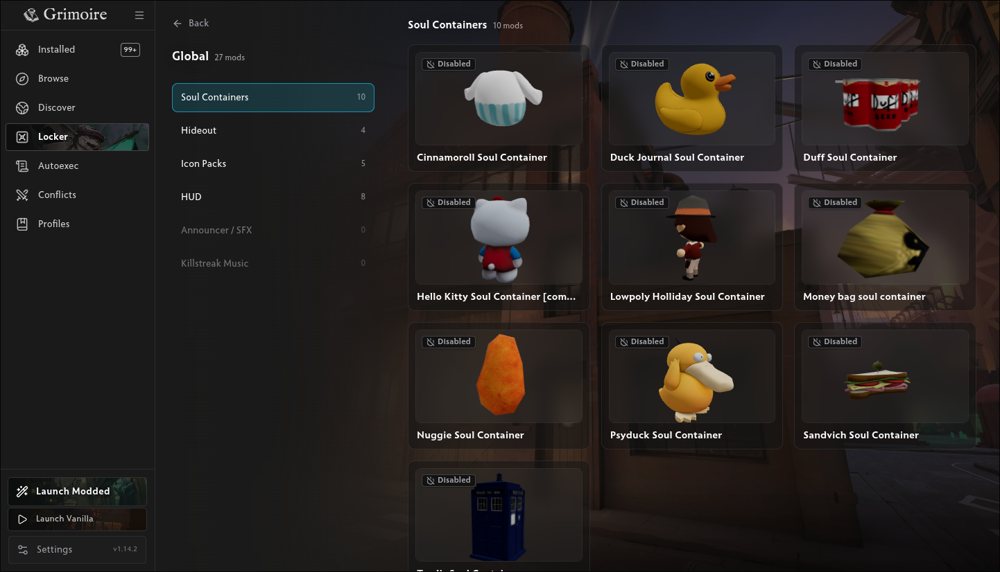
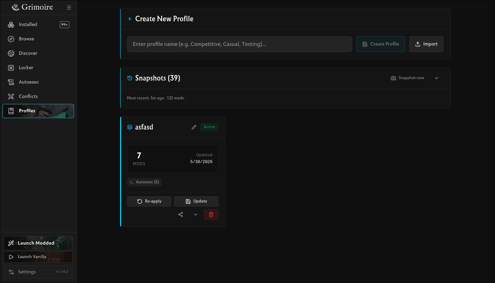

<div align="center">
 
  <h1>Grimoire</h1>
  <p>A mod manager for Deadlock.</p>

  [](https://grimoiremods.com)
  [](../../releases/latest)
  [](../../releases)
  [](https://aur.archlinux.org/packages/grimoire-bin)
  [](../../actions/workflows/ci.yml)
  [](https://translate.grimoiremods.com/engage/grimoire/)
  [](https://gamebanana.com/tools/22583)
  [](https://discord.gg/KgYGHEMq2P)
  [](LICENSE)
</div>

## Install

[Latest release →](../../releases/latest)

- Windows: `Grimoire-Setup-x.y.z.exe`
- Linux: `.AppImage` or `.deb`
- Arch Linux: `yay -S grimoire-bin` ([AUR](https://aur.archlinux.org/packages/grimoire-bin))

### Debian / Ubuntu (apt)

Install and stay updated through apt:

```bash
sudo install -d -m 0755 /etc/apt/keyrings
curl -fsSL https://apt.grimoiremods.com/grimoire.gpg | sudo tee /etc/apt/keyrings/grimoire.gpg >/dev/null
echo "deb [arch=amd64 signed-by=/etc/apt/keyrings/grimoire.gpg] https://apt.grimoiremods.com stable main" | sudo tee /etc/apt/sources.list.d/grimoire.list >/dev/null
sudo apt update && sudo apt install grimoire
```

Afterwards `sudo apt upgrade` keeps it current. More detail: [docs/apt-repo.md](docs/apt-repo.md).

Requires Deadlock installed via Steam.

## Features

**Mods**

- Browse and install from GameBanana: download queue, automatic ZIP/7Z/RAR extraction, one-click `gb1click://` installs, and collection import by URL
- Enable, disable, reorder, bulk-select, and delete, backed by an offline catalog with full-text search
- Conflict detection for mods that overwrite the same game files
- Merge several mods into one VPK (and pull individual sources back out)

**Play**

- Launch Modded or Launch Vanilla straight from the sidebar. Vanilla temporarily stashes your mods and auto-restores them once the game starts

**Locker**

- Organize cosmetic skins per hero with 2D and live 3D pose previews
- Recolor a hero's ability VFX (solid, gradient, or rainbow)
- Per-ability sound picker, plus a Global axis for soul containers and other non-hero cosmetics

**Autoexec & Profiles**

- Autoexec manager for console commands that run at game launch
- Save and swap sets of enabled mods, and share them as short `mp1:` codes or `.modprofile.json` files (Grimoire-only format)

**Experimental** (opt in under Settings)

- Discover: sign in with Steam to publish your profiles and browse uploads from other players
- Stats: MMR, match history, and hero stats from deadlock-api.com
- Crosshair designer with live preview

Offline-first and no telemetry: a fresh install phones home for nothing.

## Screenshots

|  |  |
| :---: | :---: |
| <br>**Installed**: enable, disable, reorder, bulk-select | <br>**Browse**: GameBanana media cards and filters |
| <br>**Locker**: cosmetic skins organized by hero | <br>**Skins**: per-hero, with a live 3D pose preview |
| <br>**Recolor**: shift a hero's ability VFX to any color | <br>**Sounds**: per-ability sound picker |
| <br>**Global**: soul containers and other non-hero cosmetics, in 3D | <br>**Profiles**: save, swap, and share mod sets |

## Development

```bash
git clone https://github.com/Slush97/grimoire.git
cd grimoire
pnpm install
pnpm exec electron-rebuild -f -w better-sqlite3
pnpm dev
```

Package builds: `pnpm package:win` or `pnpm package:linux`.

## Security

Grimoire is open source. Users are encouraged to read the code, build
from source, or audit any release artifact themselves before running
it. Reports of security or trust concerns are welcome via
[Issues](../../issues).

Each release ships a `SHA256SUMS` file listing the hash of every
installer. Verify a download with `sha256sum -c SHA256SUMS` (Linux) or
`Get-FileHash <file>` (PowerShell) and compare against the listing.
Releases also publish [build provenance attestations](https://docs.github.com/en/actions/security-guides/using-artifact-attestations-to-establish-provenance-for-builds)
that tie each artifact back to the exact commit and workflow run that
produced it; verify with `gh attestation verify <file> --owner Slush97`.

Windows installers are not yet code-signed, so SmartScreen will show an
"Unknown Publisher" warning on first run: click **More info → Run
anyway** to proceed. Free Authenticode signing through the SignPath
Foundation OSS program is being pursued.

## License

MIT
